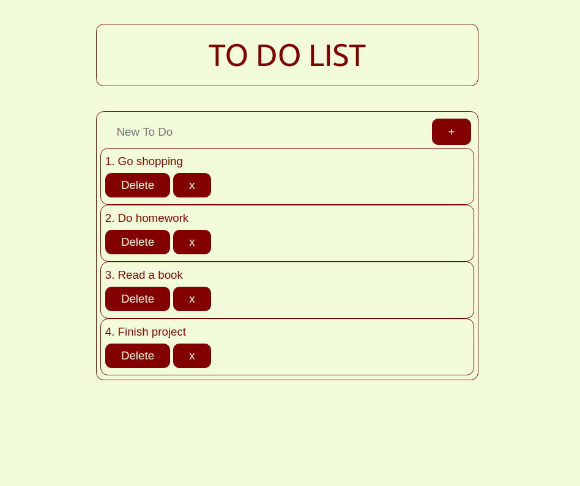

<h1>TO DO LIST</h1>

<h2>Building the TodoList</h2>

<h3>Grab latest sources:</h3>

git clone https://github.com/halimeozturk/TodoList.git

<h3>Install dependencies </h3>

cd TodoList  
npm install

<h3>Building</h3>

npm start

